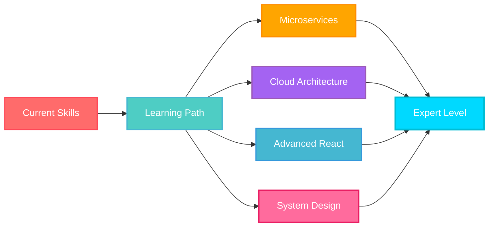

<div align="center">
  
</div>

<div align="center">
  
  [](https://git.io/typing-svg)
  
</div>

<p align="center">
  <a href="mailto:navoda991@gmail.com">
    
  </a>
  <a href="https://www.linkedin.com/in/navoda-lakshika-2017b1324">
    
  </a>
  <a href="https://github.com/NavodaLakshika">
    
  </a>
  
</p>

<div align="center">
  
</div>

<br/>

##  **About Me**


```typescript
class Developer {
  name: string = "Navoda Lakshika";
  location: string = "🇱🇰 Colombo, Sri Lanka";
  title: string = "Full Stack Developer";
  
  workExperience = {
    current: "Building Enterprise Solutions",
    focus: ["Web Applications", "RESTful APIs", "Database Design"],
    architecture: ["MVC", "Microservices", "Clean Architecture"]
  };
  
  technologies = {
    frontEnd: {
      primary: ["React.js", "JavaScript", "TypeScript"],
      styling: ["CSS3", "Bootstrap", "Material-UI", "Tailwind"],
      stateManagement: ["Redux", "Context API"]
    },
    backEnd: {
      dotNet: [".NET Core", "ASP.NET Core", "Entity Framework"],
      php: ["Laravel", "PHP"],
      java: ["Spring Boot", "Java"]
    },
    databases: {
      relational: ["SQL Server", "MySQL", "PostgreSQL"],
      orm: ["Entity Framework", "Eloquent"]
    },
    devOps: {
      cloud: ["Microsoft Azure", "AWS"],
      tools: ["Git", "Docker", "Postman", "Azure DevOps"],
      cicd: ["GitHub Actions", "Azure Pipelines"]
    }
  };
  
  learning = [
    "Microservices Architecture",
    "Advanced React Patterns",
    "Cloud Native Applications",
    "Database Performance Tuning"
  ];
  
  getCode(): string {
    return "Clean, Scalable, Maintainable";
  }
  
  getMotivation(): string {
    return "Turning coffee into code since... well, recently! ☕";
  }
}
```

<br clear="right"/>

##  **Tech Arsenal**

<div align="center">

### **💎 Frontend Mastery**

<table>
<tr>
<td align="center" width="96" style="background: linear-gradient(135deg, #667eea 0%, #764ba2 100%);">
  
  <br><span style="color: #61DAFB;">React</span>
</td>
<td align="center" width="96">
  
  <br><span style="color: #F7DF1E;">JavaScript</span>
</td>
<td align="center" width="96">
  
  <br><span style="color: #3178C6;">TypeScript</span>
</td>
<td align="center" width="96">
  
  <br><span style="color: #E34F26;">HTML5</span>
</td>
<td align="center" width="96">
  
  <br><span style="color: #1572B6;">CSS3</span>
</td>
<td align="center" width="96">
  
  <br><span style="color: #7952B3;">Bootstrap</span>
</td>
<td align="center" width="96">
  
  <br><span style="color: #0081CB;">Material UI</span>
</td>
<td align="center" width="96">
  
  <br><span style="color: #06B6D4;">Tailwind</span>
</td>
</tr>
</table>

### **⚡ Backend Powerhouse**

<table>
<tr>
<td align="center" width="96">
  
  <br><span style="color: #512BD4;">.NET Core</span>
</td>
<td align="center" width="96">
  
  <br><span style="color: #239120;">C#</span>
</td>
<td align="center" width="96">
  
  <br><span style="color: #FF2D20;">Laravel</span>
</td>
<td align="center" width="96">
  
  <br><span style="color: #777BB4;">PHP</span>
</td>
<td align="center" width="96">
  
  <br><span style="color: #ED8B00;">Java</span>
</td>
<td align="center" width="96">
  
  <br><span style="color: #339933;">Node.js</span>
</td>
</tr>
</table>

### **🗄️ Database Expertise**

<table>
<tr>
<td align="center" width="96">
  
  <br><span style="color: #4169E1;">PostgreSQL</span>
</td>
<td align="center" width="96">
  
  <br><span style="color: #4479A1;">MySQL</span>
</td>
<td align="center" width="96">
  
  <br><span style="color: #CC2927;">SQL Server</span>
</td>
<td align="center" width="96">
  
  <br><span style="color: #47A248;">MongoDB</span>
</td>
</tr>
</table>

### **🛠️ DevOps & Tools**

<table>
<tr>
<td align="center" width="96">
  
  <br><span style="color: #F05032;">Git</span>
</td>
<td align="center" width="96">
  
  <br><span style="color: #181717;">GitHub</span>
</td>
<td align="center" width="96">
  
  <br><span style="color: #2496ED;">Docker</span>
</td>
<td align="center" width="96">
  
  <br><span style="color: #0078D4;">Azure</span>
</td>
<td align="center" width="96">
  
  <br><span style="color: #FF9900;">AWS</span>
</td>
<td align="center" width="96">
  
  <br><span style="color: #FF6C37;">Postman</span>
</td>
<td align="center" width="96">
  
  <br><span style="color: #007ACC;">VS Code</span>
</td>
<td align="center" width="96">
  
  <br><span style="color: #5C2D91;">VS</span>
</td>
</tr>
</table>

</div>


##  **GitHub Performance Metrics**

<div align="center">
  
  
  
  
</div>

<div align="center">
  
  
</div>

<br/>

<div align="center">
  
</div>


##  **What I'm Currently Working On**

<div align="center">

```diff
@@                        CURRENT FOCUS 2024-2025                         @@

+ 🏗️  Architecting microservices with .NET Core & Docker
+ 🎨  Mastering advanced React patterns & performance optimization  
+ 🔐  Implementing secure authentication & authorization systems
+ 📊  Database optimization & complex query performance tuning
+ ☁️  Cloud deployment strategies with Azure & AWS
+ 🚀  Contributing to open-source projects
+ 📚  Learning Design Patterns & System Design principles
+ 🤝  Mentoring junior developers & knowledge sharing

@@                                                                        @@
```

</div>


##  **Connect & Collaborate**

<div align="center">

<p>
  <a href="mailto:navoda991@gmail.com">
    
  </a>
  <a href="https://www.linkedin.com/in/navoda-lakshika-2017b1324">
    
  </a>
  <a href="https://github.com/NavodaLakshika">
    
  </a>
  <a href="https://twitter.com/navodalakshika">
    
  </a>
  <a href="https://stackoverflow.com/users/navodalakshika">
    
  </a>
</p>

### 💬 **Open for:**
**Freelance Projects** • **Full-Time Opportunities** • **Collaboration** • **Mentorship** • **Technical Discussions**

</div>


## 🎯 **Code Philosophy**

<div align="center">
  
  

</div>

<br/>

<div align="center">

### 🌟 **My Development Principles**

| Principle | Description |
|-----------|-------------|
| 🎯 **Clean Code** | Write code that others can read and maintain |
| 🔄 **DRY Principle** | Don't Repeat Yourself - modularity is key |
| 🧪 **Test Driven** | Tests are not optional, they're essential |
| 📖 **Documentation** | Good code explains itself, great code has docs |
| ⚡ **Performance** | Optimize when needed, don't over-engineer |
| 🔐 **Security First** | Security is not a feature, it's a requirement |

</div>


## 📈 **Coding Activity**

<div align="center">
  
<!--START_SECTION:waka-->
<!--END_SECTION:waka-->


</div>


## 🎓 **Continuous Learning Journey**

<div align="center">



</div>


<div align="center">

## 💖 **Support My Work**

<p>If you like my projects and want to support my work, consider buying me a coffee! ☕</p>

<a href="https://www.buymeacoffee.com/navodalakshika">
  
</a>

</div>

<br/>

<div align="center">
  
</div>

<div align="center">
  
### 🌟 Show some ❤️ by starring some of my repositories! 🌟


</div>

<div align="center">
  
  **⭐️ From [NavodaLakshika](https://github.com/NavodaLakshika) • Let's build something amazing together! 🚀**
  
  
  
</div>
